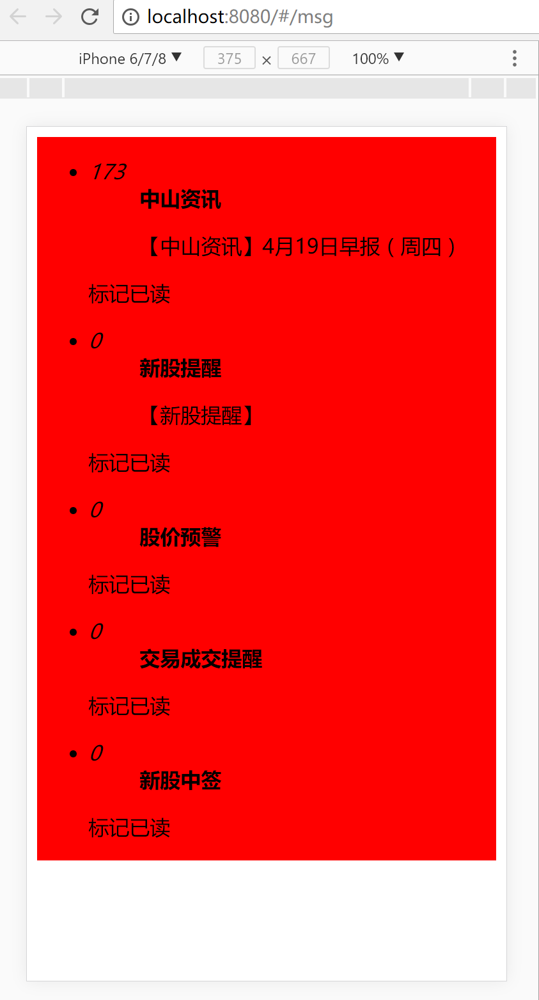

# zs_app
[github地址](https://github.com/larben/zs_app.git)

###启动服务 node环境下按步骤执行下面指令。2和3是开启服务不能关闭的，所以是开两个终端执行命令，2和3的执行顺序可乱
    1.yarn install 安装package依赖
    2.yarn start 程序启动服务
    3.node server 静态web资源服务

